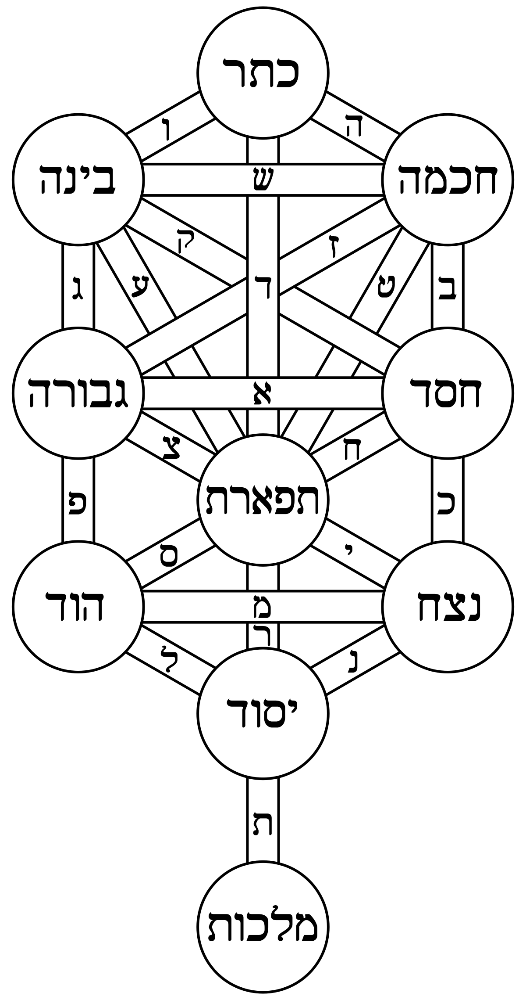

# An expiriement in many languages to codify my thought processes.

The word holon represents a self-stable unit of being.

A holon can transcend to form other holons (eg: governments).

It can also disintegrate into inferior holons (eg: cells).




# compile Lisp
```bash
cd lisp
```
```lisp
(adsf:load-asd "holon.asd")
(ql:quickload :holon)

;; fix lisp errors w/ debugger :(


(in-package :holon.task)
(save-lisp-and-die "holon.task" :executable t)
```

# checkin
Oct 31: Tree Cybernetics Stream by @kuberlog the CyberRanger
